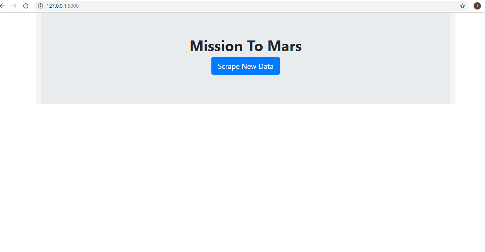
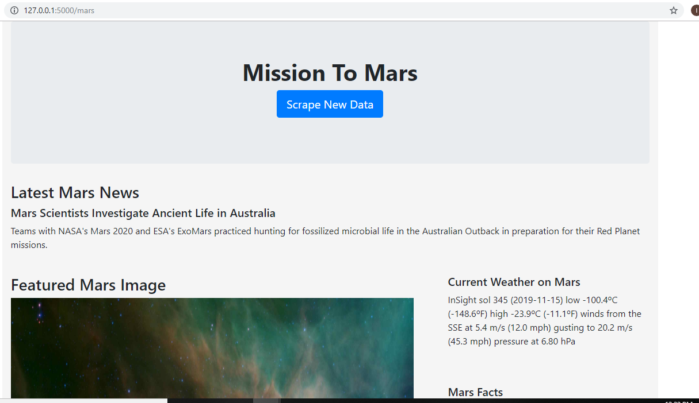
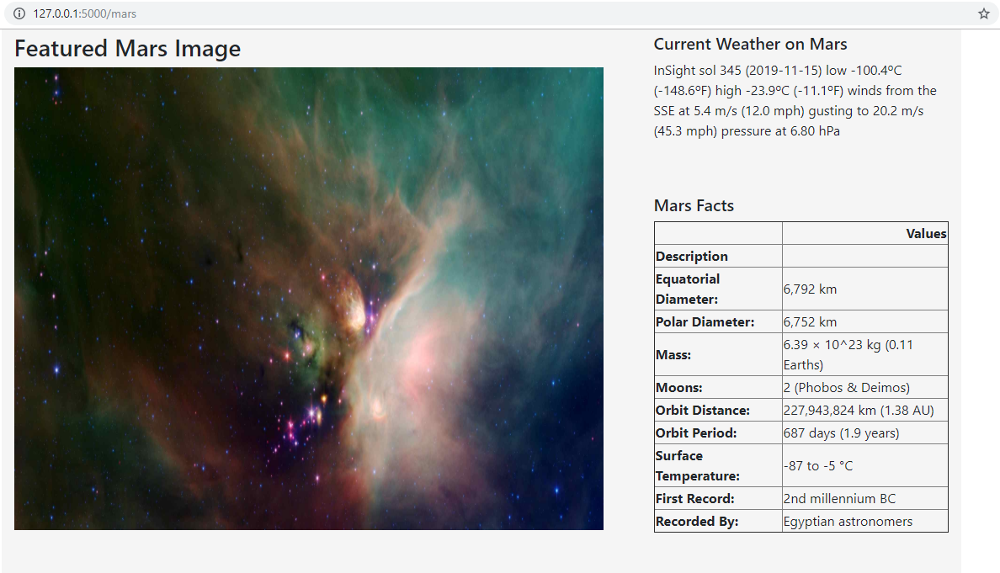
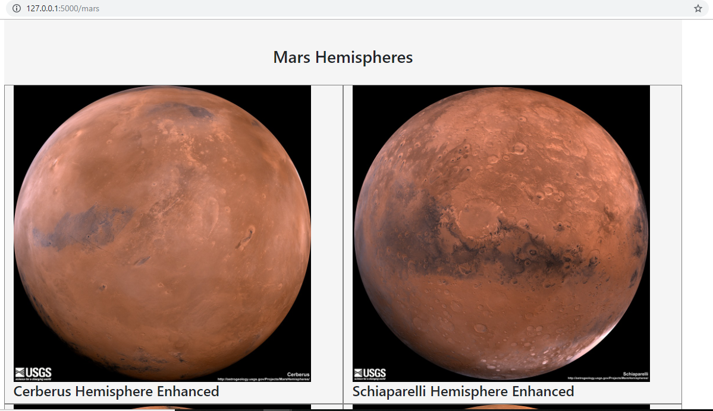
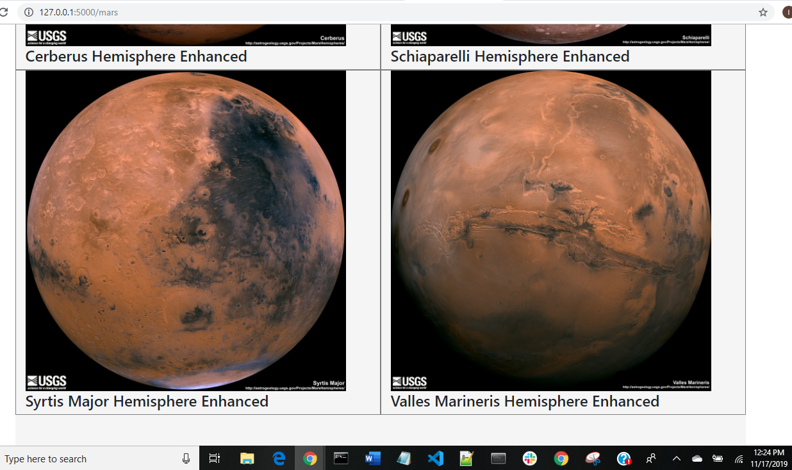

# Mission to Mars

## Objective: To scrape the following latest Mars information from NASA website and render that scraped information to an HTML Page

  - NASA Mars News
  - JPL Mars Space Images - Featured Image
  - Mars Weather
  - Mars Facts
  - Mars Hemispheres

## Tools Used: Jupyter Notebook, Python, Pandas, Flask, Splinter, MongoDB, PyMongo, HTML, Bootstrap

### Tasks done to do scraping and rendering :
- Scraped the NASA Mars News Site and collect the latest News Title and Paragraph Text. ( https://mars.nasa.gov/news/) 
- Visited the url for JPL Featured Space Image and used splinter to navigate the site and find the full image url for the current Featured Mars Image ( https://www.jpl.nasa.gov/spaceimages/?search=&category=Mars)
- Visited the Mars Weather twitter account and scrape the latest Mars weather tweet from the page. (https://twitter.com/marswxreport?lang=en)
- Visited the Mars Facts webpage and use Pandas to scrape the table containing facts about the planet including Diameter, Mass, etc. (https://space-facts.com/mars/)
- Visited the USGS Astrogeology site to obtain high resolution images for each of Mar's hemispheres.(https://astrogeology.usgs.gov/search/results?q=hemisphere+enhanced&k1=target&v1=Mars)
- Created scrape_mars.py with a function called scrape that executes all of the scraping code and return one Python dictionary containing all of the scraped data.
- In app.py -
   - Created a route called /scrape that imports scrape_mars.py script and call the scrape function.
   - Created a root route / that will query the Mongo database and pass the mars data into an HTML template to display the data.
- Created a template HTML file called index.html that will take the mars data dictionary and display all of the data in the appropriate HTML elements. 
- Clicking on "Scrape New Data" button on main page...scrapes all data and renders information within few minutes.

## HTML Page with scraped information and images

### 1 

### 2

### 3

### 4

### 5

